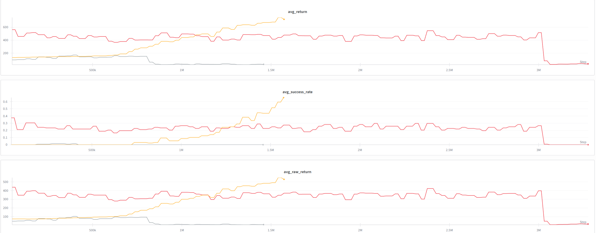

# Experiments Log

## Experiment 4->5:

**Script:** 
[rl_osc_delta_current.py](../rl_osc_delta_current.py)
[factory_tasks_cfg](../factory_tasks_cfg.py)

**Description:**
- exp 4->5
- peg position and noise (0.016) noise [0.003, 0.0, 0.005] --> (0.008) [0.003, 0.0, 0.003]
- [0.05, 0.05, 0.05] --> [0.07, 0.07, 0.07]

(cons peg position not held correctly so the success is not happening)
(peg is titled i tried to push using keyboard it didnt work )

**Training Graph:**

<!-- **inference video**
 -->
---
